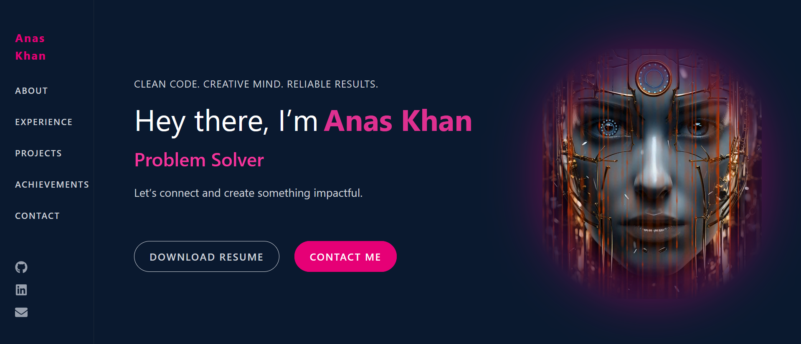

# 🧑‍💻 Anas Khan - Developer Portfolio

Welcome to my personal developer portfolio built using **Next.js 14**, **Tailwind CSS**, and modern design principles. This site showcases my featured and full-stack projects, development skills, and a direct way to connect with me.

> ⚡ **Built in just 3 days** with focus, passion, and precision.



---

## 🚀 Tech Stack

- ⚡ **Next.js 14** – React framework for server-side rendering and routing
- 🎨 **Tailwind CSS** – Utility-first CSS for custom design
- 🎥 **Hero Section Video** – Animated glitch effects with radial masking
- 🎮 **Lucide Icons** – Lightweight, beautiful SVG icons
- ✨ **Responsive Design** – Fully responsive for all screen sizes
- 📂 **File Structure**
  - `/components` – Reusable components like `Hero`, `Projects`, `PrimaryButton`, etc.
  - `/app` – Routing and page components
  - `/public` – Assets such as images and videos

---

## 📁 Project Sections

- **Hero Section** – Interactive intro with glitch text and animated titles
- **Featured Projects** – A preview of top projects with hover animations
- **All Projects Page** – Category filters and back navigation
- **Contact Form** – Send messages directly via form submission

---

## 🛠 How to Run Locally

```bash
# 1. Clone the repo
git clone https://github.com/iamanaskhan10/portfolio.git
cd portfolio

# 2. Install dependencies
npm install

# 3. Run the dev server
npm run dev

# Open in browser
http://localhost:3000
Live Preview

🔗 https://my-portfolio-nextjs-sepia-zeta.vercel.app/
📬 Contact

    Email: anas23khan2002@gmail.com

    LinkedIn: Anas Khan

    GitHub: @iamanaskhan10
⭐ Features

    Glitch-text hero animation

    "Contact Me" and "Download Resume" buttons with custom styles

    Category-based project filtering

    Back button with arrow navigation

    Clean and modern code structure

    Fully mobile responsive

⏱️ Built With Speed & Focus

This project was built in just 3 days as a personal challenge to test my skills and creativity.
